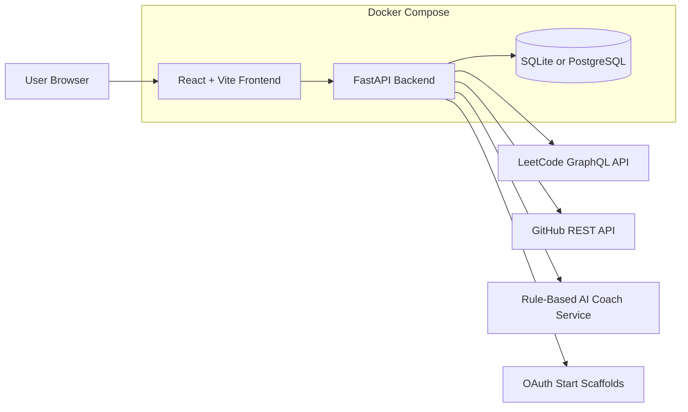

<div align="center">

# AlgoPilot-AI

**AI-powered DSA progress tracking and coding practice companion**

AlgoPilot-AI is a full-stack DSA progress and coding-practice companion that brings LeetCode analytics, coding profiles, and structured preparation into one dashboard. Track progress, analyze performance, identify areas for improvement, and build a more focused problem-solving routine.


</div>

## About the Project

AlgoPilot-AI is built for developers who want a clearer view of their DSA practice instead of scattered notes, disconnected coding profiles, and vague preparation plans. The core full-stack platform is implemented with account-based access, public LeetCode and GitHub data fetching, protected dashboard views, analytics screens, and Dockerized local development.

Advanced AI coaching, deeper personalization, persistent weak-topic analysis, and generated learning plans are under active development. Where the current app uses static planner data or rule-based coaching responses, those capabilities are labeled as starter-level or planned below.

## Features

### Implemented

- **Authentication**: Register, login, JWT-based protected routes, password hashing, and current-user lookup.
- **User profile storage**: Stores name, email, LeetCode username, GitHub username, and LinkedIn URL.
- **LeetCode progress tracking**: Fetches public LeetCode profile data, solved-count stats, ranking metadata, and submission calendar data through LeetCode GraphQL endpoints.
- **Dashboard**: Shows account status, connected coding profile handles, LeetCode summary cards, and GitHub public profile data when configured.
- **Analytics view**: Displays LeetCode solved counts by difficulty and submission activity metrics.
- **GitHub integration**: Fetches public GitHub profile information and up to 10 recently updated repositories.
- **AI Coach starter**: Provides rule-based coaching, hint, and review responses through the backend `/dashboard/ai` endpoint.
- **Roadmap/planner starter**: Displays daily practice, company preparation, and revision planning UI using starter data.
- **OAuth start scaffolding**: Generates provider authorization URLs for Google, GitHub, and LinkedIn when client IDs are configured.
- **Dockerized local setup**: Runs PostgreSQL, FastAPI, and Vite frontend through Docker Compose.

### Planned / Starter-Level

- Persistent topic-level skill tracking and weak-topic scoring.
- Fully personalized roadmap generation based on user history.
- LLM-backed AI coaching, code review, interview simulation, and hints.
- OAuth callback handling and account linking.
- PDF report generation.
- Richer charts, heatmaps, and analytics derived from stored historical snapshots.

## Tech Stack

### Frontend

- React 19
- Vite
- React Router
- Lucide React
- CSS modules via `frontend/src/styles.css`

### Backend

- FastAPI
- SQLAlchemy
- Pydantic
- Uvicorn
- python-jose for JWTs
- PBKDF2 password hashing via Python standard library

### Database

- SQLite for default/manual local development (`algopilot.db`)
- PostgreSQL 16 for Docker Compose

### AI / Integrations

- LeetCode public GraphQL API
- GitHub public REST API
- Rule-based AI coach service scaffold
- Google, GitHub, and LinkedIn OAuth authorization URL scaffolds

### DevOps

- Docker Compose
- Backend and frontend Dockerfiles
- GitHub Actions CI for backend compile checks and frontend builds

## Project Architecture



## Project Structure

```text
AlgoPilot-AI/
├── backend/
│   ├── app/
│   │   ├── main.py                 # FastAPI app setup and router registration
│   │   ├── database.py             # SQLAlchemy engine/session configuration
│   │   ├── models.py               # User model
│   │   ├── schemas.py              # Pydantic request/response schemas
│   │   ├── auth.py                 # Password hashing and JWT helpers
│   │   ├── routes/                 # Auth, dashboard, LeetCode, GitHub, OAuth, reports
│   │   └── services/               # LeetCode, GitHub, and coach services
│   ├── .env.example
│   ├── Dockerfile
│   └── requirements.txt
├── frontend/
│   ├── src/
│   │   ├── pages/                  # Login, register, dashboard, analytics, coach, roadmap
│   │   ├── components/             # Navbar, cards, LeetCode profile summary
│   │   ├── api.js                  # Frontend API helper
│   │   ├── App.jsx
│   │   └── main.jsx
│   ├── .env.example
│   ├── Dockerfile
│   ├── package.json
│   └── vite.config.js
├── .github/workflows/ci.yml
├── docker-compose.yml
└── README.md
```

## Getting Started

### Prerequisites

- Git
- Docker and Docker Compose
- Python 3.12+
- Node.js 20+
- npm

### Clone the Repository

```bash
git clone <repository-url>
cd AlgoPilot-AI
```

### Environment Configuration

Create local environment files from the examples:

```bash
cp backend/.env.example backend/.env
cp frontend/.env.example frontend/.env
```

For Docker Compose, the required database and API values are already provided in `docker-compose.yml`. For manual local development, review the generated `.env` files before starting each service.

### Run with Docker Compose

Docker Compose is the easiest way to run the full stack locally:

```bash
docker compose up --build
```

Services will be available at:

- Frontend: `http://localhost:5173`
- Backend API: `http://localhost:8000`
- Swagger docs: `http://localhost:8000/docs`
- PostgreSQL: `localhost:5432`

The Docker database is named `algopilot`, and the containers are named `algopilot-postgres`, `algopilot-backend`, and `algopilot-frontend`.

### Manual Backend Setup

```bash
cd backend
python3 -m venv venv
source venv/bin/activate
pip install -r requirements.txt
cp .env.example .env
python -m uvicorn app.main:app --reload --port 8000
```

On Windows PowerShell, activate the virtual environment with:

```powershell
.\venv\Scripts\Activate.ps1
```

By default, the backend uses SQLite at `backend/algopilot.db` unless `DATABASE_URL` is changed.

### Manual Frontend Setup

Open a second terminal:

```bash
cd frontend
npm install
cp .env.example .env
npm run dev
```

The frontend will run at `http://localhost:5173` and will call the backend URL configured by `VITE_API_URL`.

## Environment Variables

### Backend

Defined in [`backend/.env.example`](backend/.env.example):

| Variable | Purpose | Default / Example |
| --- | --- | --- |
| `DATABASE_URL` | SQLAlchemy database connection URL | `sqlite:///./algopilot.db` |
| `SECRET_KEY` | JWT signing secret | Replace with a long random secret |
| `ALGORITHM` | JWT signing algorithm | `HS256` |
| `ACCESS_TOKEN_EXPIRE_MINUTES` | Access token lifetime in minutes | `1440` |
| `FRONTEND_URL` | Frontend origin for local app links/integrations | `http://localhost:5173` |
| `GOOGLE_CLIENT_ID` | Google OAuth client ID | Empty by default |
| `GOOGLE_CLIENT_SECRET` | Google OAuth client secret | Empty by default |
| `GITHUB_CLIENT_ID` | GitHub OAuth client ID | Empty by default |
| `GITHUB_CLIENT_SECRET` | GitHub OAuth client secret | Empty by default |
| `LINKEDIN_CLIENT_ID` | LinkedIn OAuth client ID | Empty by default |
| `LINKEDIN_CLIENT_SECRET` | LinkedIn OAuth client secret | Empty by default |

### Frontend

Defined in [`frontend/.env.example`](frontend/.env.example):

| Variable | Purpose | Default / Example |
| --- | --- | --- |
| `VITE_API_URL` | Base URL for backend API requests | `http://127.0.0.1:8000` |

## API Documentation

When the backend is running locally, FastAPI Swagger documentation is available at:

```text
http://localhost:8000/docs
```

Key implemented API areas:

| Method | Endpoint | Description |
| --- | --- | --- |
| `GET` | `/` | API health/root message |
| `GET` | `/health` | Health check |
| `POST` | `/register` | Create an account |
| `POST` | `/login` | Authenticate and receive a bearer token |
| `GET` | `/me` | Return the authenticated user |
| `GET` | `/leetcode/profile` | Fetch the authenticated user's configured LeetCode profile |
| `GET` | `/leetcode/calendar` | Fetch the authenticated user's LeetCode submission calendar |
| `GET` | `/github/profile` | Fetch the authenticated user's configured GitHub profile |
| `GET` | `/dashboard/summary` | Return account/profile summary data |
| `POST` | `/dashboard/ai` | Return starter coach/hint/review guidance |
| `GET` | `/dashboard/planner` | Return starter roadmap items |
| `GET` | `/oauth/{provider}/start` | Generate an OAuth authorization URL for supported providers |
| `GET` | `/reports/pdf` | Placeholder endpoint for future PDF generation |

Routes under `/leetcode/...` intentionally keep the LeetCode name because they integrate with the external LeetCode platform.

## Usage

1. Create an account with your name, email, password, and optional coding profile handles.
2. Log in to access protected pages.
3. Open the dashboard to review account status, LeetCode stats, and GitHub profile data.
4. Visit analytics to inspect solved counts and submission activity.
5. Use AI Coach for starter guidance, hints, and review prompts.
6. Open the roadmap page to view starter daily practice and revision planning.

## Screenshots

### Login / Register

<!-- Add screenshot later: docs/screenshots/login-register.png -->

### Dashboard

<!-- Add screenshot later: docs/screenshots/dashboard.png -->

### Analytics

<!-- Add screenshot later: docs/screenshots/analytics.png -->

### AI Coach

<!-- Add screenshot later: docs/screenshots/ai-coach.png -->

### Roadmap

<!-- Add screenshot later: docs/screenshots/roadmap.png -->

## Roadmap

### Completed

- React/Vite frontend with protected app routes.
- FastAPI backend with Swagger documentation.
- JWT authentication and password hashing.
- SQLAlchemy user model and automatic table creation.
- SQLite default database and PostgreSQL Docker Compose setup.
- LeetCode profile and calendar fetching.
- GitHub public profile and repository fetching.
- Dashboard, analytics, AI Coach, roadmap, pricing, login, and register pages.
- Dockerfiles for frontend and backend.
- GitHub Actions CI workflow.

### Upcoming

- Store periodic LeetCode snapshots for historical analytics.
- Replace static topic analysis with real topic-level performance data.
- Add persistent planner items and completion tracking.
- Integrate an LLM provider for contextual AI coaching and code review.
- Complete OAuth callback flows and connected-account persistence.
- Implement PDF report generation.
- Add automated backend route tests and frontend component tests.

## Contributing

Contributions are welcome. To propose a change:

1. Fork the repository.
2. Create a feature branch.
3. Make a focused change with clear commits.
4. Run the relevant checks locally.
5. Open a pull request with a concise description and screenshots when UI changes are involved.

Recommended checks:

```bash
python -m compileall backend/app
cd frontend
npm run build
```

---

Built to help developers practice with more feedback, structure, and momentum.
