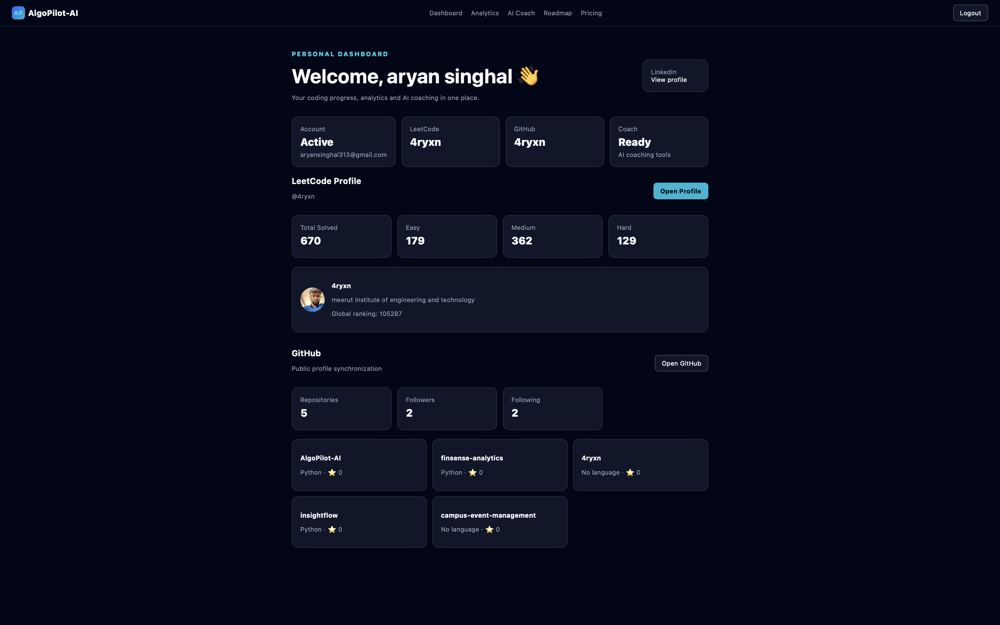
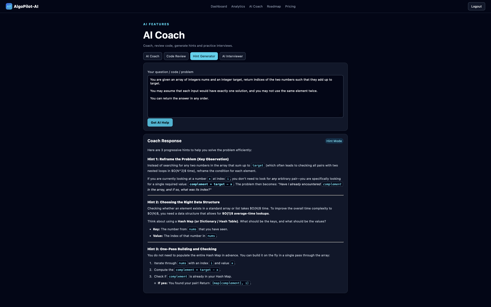
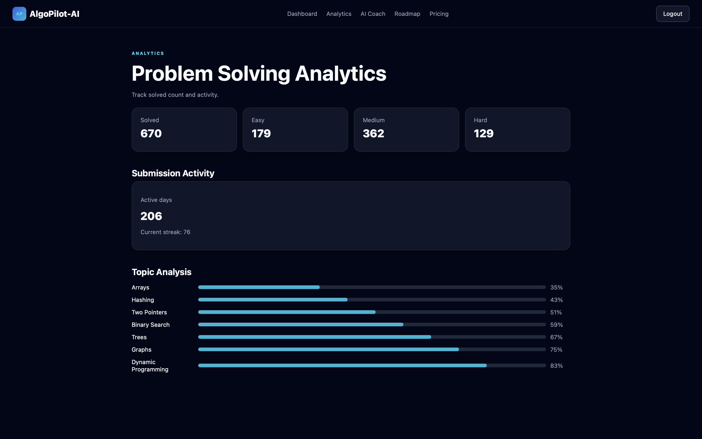
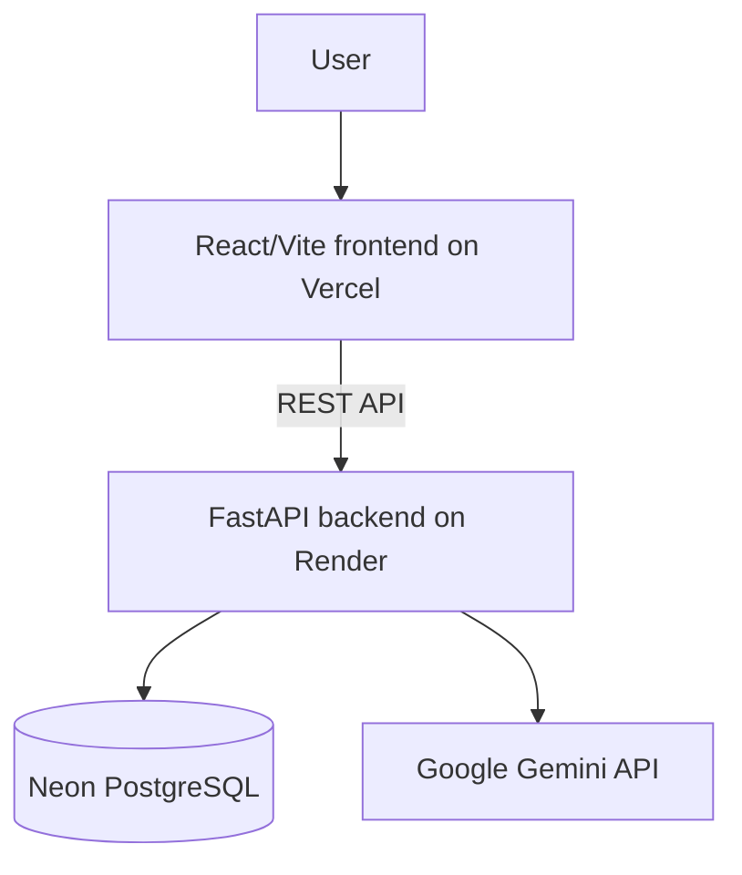

# AlgoPilot-AI

**AI-powered DSA analytics, coaching, and interview preparation platform**

AlgoPilot-AI helps developers prepare for coding interviews by bringing DSA progress tracking, profile analytics, and Gemini-powered coaching into one app. It connects public LeetCode and GitHub data with a protected dashboard, then lets users ask for problem-specific guidance, code review, hints, and interview-style prompts.

## Live Demo

- **Live Application: https://algo-pilot-ai.vercel.app/**
- Backend API: https://algopilot-backend-mudn.onrender.com
- FastAPI API Docs: https://algopilot-backend-mudn.onrender.com/docs

## Overview

AlgoPilot-AI is a full-stack platform for developers preparing for DSA interviews. It combines account-based access, LeetCode and GitHub profile data, progress analytics, a starter roadmap view, and AI-powered coaching through Google Gemini.

The app helps users review solved-count progress, inspect public coding profile data, request problem-specific AI guidance, and practice with interview-oriented prompts in one protected dashboard experience.

## Key Features

- LeetCode analytics for solved counts, difficulty breakdowns, ranking, streak, and active-day metrics.
- GitHub profile integration for public profile stats and recently updated repositories.
- Gemini-powered AI Coach that returns problem-specific Markdown responses instead of hardcoded guidance.
- Code Review mode for correctness, edge cases, complexity, code quality, and optimization feedback.
- Progressive DSA hints that guide users without immediately revealing the full solution.
- AI Interviewer mode for interview-style follow-up questions and next-step prompts.
- JWT authentication with protected dashboard, analytics, AI Coach, and roadmap routes.
- Analytics dashboard for solved-count summaries, submission activity, and starter topic analysis.
- Roadmap and planning screens for starter daily practice, company preparation, and revision sections.

## Screenshots

### Dashboard

Overview of coding profile connections, LeetCode stats, GitHub data, and account status.



### AI Coach

Gemini-powered DSA guidance with coaching, review, hint, and interview modes.



### Analytics

Solved-count analytics, activity metrics, and starter topic analysis in one view.



## AI Coach

The AI Coach is exposed through the protected `/dashboard/ai` backend endpoint. The backend builds a mode-specific prompt, sends it to Google Gemini using `google-genai`, and returns the generated response for Markdown rendering in the React frontend.

- AI Coach: analyzes a problem or code sample, covering constraints, brute force, key observations, optimized approach, data structures or algorithms, and complexity.
- Code Review: reviews a submitted approach or solution for correctness, bugs, edge cases, time and space complexity, code quality, and optimization opportunities.
- Hint Generator: provides 2-4 progressive hints tailored to the submitted problem or code without immediately giving away the complete solution.
- AI Interviewer: simulates an interviewer by asking follow-up questions, suggesting next steps, and nudging the user toward the right technique.

## Tech Stack

### Frontend

- React
- Vite
- React Router
- React Markdown
- Lucide React
- CSS in `frontend/src/styles.css`

### Backend

- Python
- FastAPI
- SQLAlchemy
- Pydantic
- Uvicorn
- JWT authentication with `python-jose`
- PBKDF2 password hashing with Python standard library modules
- Google Gemini through `google-genai`
- Requests for LeetCode and GitHub API calls
- python-dotenv

### Database

- PostgreSQL
- Neon PostgreSQL in production
- SQLite fallback for local manual development when `DATABASE_URL` is not overridden

### Deployment

- Vercel for the frontend
- Render for the backend
- Neon PostgreSQL for the production database

## Architecture



## Local Development

### 1. Clone

```bash
git clone <repository-url>
cd AlgoPilot-AI
```

### 2. Backend

```bash
cd backend
python3 -m venv venv
source venv/bin/activate
pip install -r requirements.txt
cp .env.example .env
```

On Windows PowerShell, activate the environment with:

```powershell
.\venv\Scripts\Activate.ps1
```

Update `backend/.env` with local values. Use `DATABASE_URL` for PostgreSQL or keep the default SQLite URL for manual local development. Add `GEMINI_API_KEY` to enable Gemini responses.

```bash
python -m uvicorn app.main:app --reload --port 8000
```

The local API will be available at `http://127.0.0.1:8000`, with docs at `http://127.0.0.1:8000/docs`.

### 3. Frontend

Open a second terminal:

```bash
cd frontend
npm install
cp .env.example .env
npm run dev
```

The local frontend will run at `http://localhost:5173` and read the backend URL from `VITE_API_URL`.

### Optional Docker Compose

The repository also includes `docker-compose.yml` for running PostgreSQL, the FastAPI backend, and the Vite frontend together:

```bash
docker compose up --build
```

## Environment Variables

Variable names only. Do not commit real secrets.

### Core backend

- `DATABASE_URL`
- `SECRET_KEY`
- `ALGORITHM`
- `ACCESS_TOKEN_EXPIRE_MINUTES`
- `FRONTEND_URL`
- `GEMINI_API_KEY`

### Optional OAuth

- `GOOGLE_CLIENT_ID`
- `GOOGLE_CLIENT_SECRET`
- `GITHUB_CLIENT_ID`
- `GITHUB_CLIENT_SECRET`
- `LINKEDIN_CLIENT_ID`
- `LINKEDIN_CLIENT_SECRET`

### Frontend

- `VITE_API_URL`

## Deployment

- Frontend: deployed on Vercel at https://algo-pilot-ai.vercel.app/
- Backend: deployed on Render at https://algopilot-backend-mudn.onrender.com
- Database: hosted on Neon PostgreSQL and connected to the Render backend through `DATABASE_URL`.

## Project Structure

```text
AlgoPilot-AI/
├── assets/
│   ├── ai-coach.png
│   ├── analytics.png
│   └── dashboard.png
├── backend/
│   ├── app/
│   │   ├── routes/
│   │   │   ├── auth_routes.py
│   │   │   ├── dashboard_routes.py
│   │   │   ├── github_routes.py
│   │   │   ├── leetcode_routes.py
│   │   │   ├── oauth_routes.py
│   │   │   └── report_routes.py
│   │   ├── services/
│   │   │   ├── ai_service.py
│   │   │   ├── github_service.py
│   │   │   └── leetcode_service.py
│   │   ├── auth.py
│   │   ├── database.py
│   │   ├── main.py
│   │   ├── models.py
│   │   └── schemas.py
│   ├── .env.example
│   ├── Dockerfile
│   └── requirements.txt
├── frontend/
│   ├── src/
│   │   ├── components/
│   │   │   ├── Card.jsx
│   │   │   ├── LeetCodeProfile.jsx
│   │   │   └── Navbar.jsx
│   │   ├── pages/
│   │   │   ├── AICoach.jsx
│   │   │   ├── Analytics.jsx
│   │   │   ├── Dashboard.jsx
│   │   │   ├── Login.jsx
│   │   │   ├── Pricing.jsx
│   │   │   ├── Register.jsx
│   │   │   └── Roadmap.jsx
│   │   ├── api.js
│   │   ├── App.jsx
│   │   ├── main.jsx
│   │   └── styles.css
│   ├── .env.example
│   ├── Dockerfile
│   ├── index.html
│   ├── package.json
│   └── vite.config.js
├── docker-compose.yml
└── README.md
```

## Future Improvements

- Persist historical LeetCode snapshots for richer long-term analytics.
- Replace the current starter topic-analysis values with real topic-level performance data.
- Add saved roadmap tasks, completion tracking, and personalized practice plans.
- Complete OAuth callback flows and connected-account persistence.
- Add automated backend route tests and frontend component tests.

## Author

Aryan Singhal
